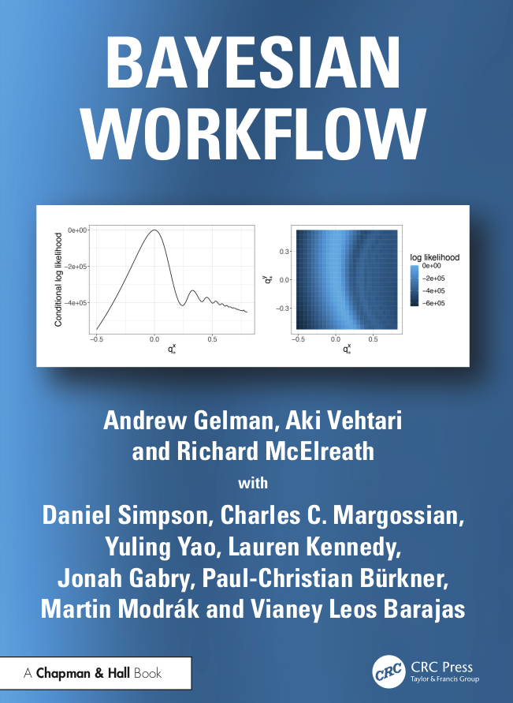

## Information

:::: {layout="[ 85, 15 ]"}

::: {#first-column}
These are the Python version of the case studies from the **Bayesian Workflow** book by 
[Andrew Gelman](http://www.stat.columbia.edu/~gelman/), 
[Aki Vehtari](https://users.aalto.fi/ave/),
[Richard McElreath](https://xcelab.net/rm/) with 
Daniel Simpson, 
[Charles C. Margossian](https://charlesm93.github.io/),
[Yuling Yao](https://yulingyao.com/),
[Lauren Kennedy](https://jazzystats.com/),
[Jonah Gabry](https://jgabry.github.io/),
[Paul-Christian Bürkner](https://paulbuerkner.com/),
[Martin Modrák](https://www.martinmodrak.cz/),
[Vianey Leos Barajas](https://www.vleosbarajas.com/).

Published by CRC Press in 2026. Copyright by the authors.

- Buy the book via [publisher's website](https://www.routledge.com/Bayesian-Workflow/Gelman-Vehtari-McElreath-Simpson-Margossian-Yao-Kennedy-Gabry-Burkner-Modrak-Barajas/p/book/9780367490140). 20% Discount code: 26ESA2.


These cases studies use the following Python libraries for Bayesian modeling and workflow:

- PPLs
  - [CmdStanPy](https://mc-stan.org/cmdstanpy/)
  - [numpyro](https://num.pyro.ai/en/stable/)
- [ArviZ](https://python.arviz.org/en/stable/) for MCMC diagnostics, model checking, model comparison, and visualization
- [Bambi](https://bambinos.github.io/bambi/) for fitting some models in selected case studies
- [Kulprit](https://kulprit.readthedocs.io/en/latest/) for variable selection.

For the original R and Stan code, and other information like the book's errata, please refer to the [book website](https://avehtari.github.io/Bayesian-Workflow/).

- If you notice and **error with the code in this repository**, please [submit an issue](https://github.com/arviz-devs/Bayesian-Workflow/issues).
- If instead you notice an **error in the book** not mentioned in [the errata](errata.html), [submit an issue](https://github.com/avehtari/Bayesian-Workflow/issues) or send an email to the book authors.


<details><summary>How to cite</summary>

Cite the book:

> Gelman, Vehtari, McElreath, Simpson, Margossian, Yao, Kennedy, Gabry, Bürkner, Modrák, Leos Barajas (2026). *Bayesian Workflow*. Chapman & Hall.

If you want to refer to a case study, cite the book and chapter, e.g.

> blah blah (Gelman et al., 2026, Ch 18 code).

BibTeX entry:

```
@book{Bayesian-Workflow:2026,
  title={Bayesian Workflow},
  author={Andrew Gelman and Aki Vehtari and Richard McElreath and Daniel Simpson and
          Charles C. Margossian and Yuling Yao and Lauren Kennedy and Jonah Gabry and
          Paul-Christian Bürkner and Martin Modrák and Vianey Leos Barajas},
  year=2026,
  publisher={Chapman & Hall}
}
```
</details>
:::

::: {#second-column}
{width=120 fig-alt="Cover of the Bayesian Workflow book"}
:::

::::